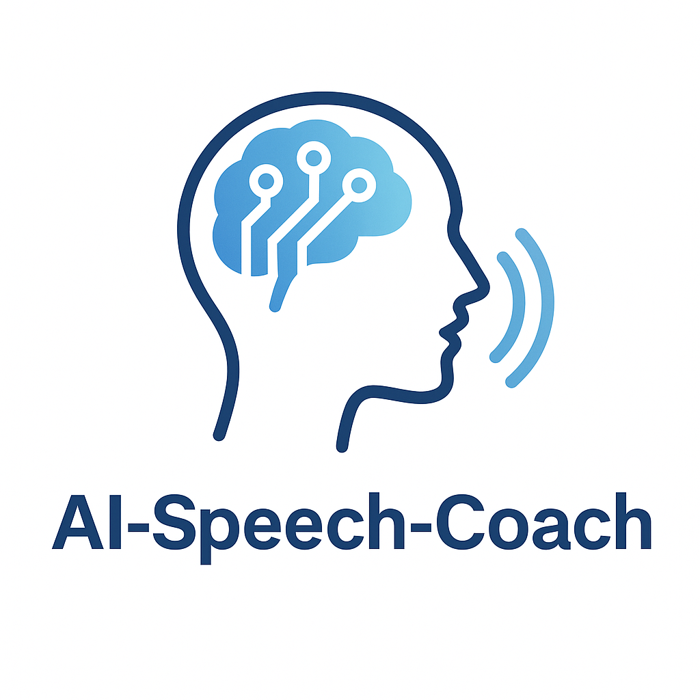

# AI-Speech-Coach

An AI-powered tool providing personalized feedback and guidance to improve articulation and speaking skills.

## Sparking the Idea: Video Inspiration

## On Becoming Articulate

### Exploring the power of articulate communication and its pathway to personal growth

## Overview

The video captures insights on the importance of developing articulate communication skills and how they serve as a foundation for competence, influence, and personal development across all areas of life.

## Key Themes

### The Power of Articulation

Articulation extends beyond mere speech - it represents the ability to differentiate, organize, and express thoughts with precision. Just as articulated joints enable graceful movement, articulated speech enables effective communication and action.

### Universal Application

Regardless of profession or calling, the ability to communicate clearly provides fundamental advantages:

- **Negotiation** with clients and partners
- **Leadership** of teams and colleagues
- **Problem-solving** through structured thinking
- **Strategic planning** with clear vision
- **Relationship building** through genuine connection

### Cultural Foundation

Our entire culture is built upon the principle that articulate expression creates order from chaos. This isn't merely philosophical - it's a practical truth that manifests in every successful endeavor.

## The Path to Articulation

### 1. Pay Attention to Your Words

Monitor your speech like navigating a treacherous path - feel for solid ground with each word choice. Ask yourself:

- Does this word strengthen or weaken me?
- Am I speaking truthfully or instrumentally?
- Is my communication genuine or manipulative?

### 2. Align Language with Being

Integrate what you say with who you are. This alignment creates:

- **Authenticity** that others recognize and trust
- **Strength** that comes from internal coherence
- **Influence** that emerges naturally from genuine expression

### 3. Practice Truth-Telling

Begin with simple honesty in your daily communication:

- Eliminate filler words and hesitation
- Take time to craft words carefully
- Say only what you believe to be true
- Listen to yourself as you speak

### 4. Read and Write

Engage with great writers and practice expressing your own thoughts:

- Study articulate authors and speakers
- Write about problems that concern you
- Develop your unique voice through practice
- Challenge yourself with complex ideas

### 5. Embrace the Pause

Before responding in conversation, pause and genuinely ask yourself: "What do I actually think about this"
This requires:

- **Curiosity** about your own thoughts
- **Humility** about what you don't know
- **Patience** to let genuine responses emerge
- **Courage** to abandon predetermined answers

## The Alternative

The choice is clear: develop articulate communication or remain "vague and useless." Choosing inarticulation means:

- Inability to formulate strategy
- Failure to inspire or convince others
- Awkwardness instead of grace
- Missed opportunities for connection and growth

## Examples of Excellence

### The Warrior-Communicator

Effective leaders in high-stakes environments understand that communication is not separate from competence - it IS competence. The ability to:

- Listen effectively to subordinates
- Explain situations clearly to superiors
- Advocate for deserving team members
- Think strategically and plan effectively

### The Genuine Inquirer

Success often comes to those who approach communication with honest curiosity rather than instrumental goals. This means:

- Asking questions you genuinely want answered
- Listening without agenda
- Sharing the journey of discovery with others
- Allowing truth to emerge through dialogue

## The Moral Dimension

Becoming articulate is fundamentally a moral endeavor - it requires treating language as sacred and powerful. This involves:

- Recognizing words as tools of creation
- Taking responsibility for your communication
- Committing fully to the practice
- Viewing articulation as a pathway to divine expression

## Conclusion

The journey toward articulation is simultaneously the adventure of your life and a pathway to genuine success. It requires abandoning the instrumental use of language in favor of truthful expression, patient inquiry, and authentic engagement with both yourself and others.

> "If you're guided by the spirit of honest inquiry and every word you say is reflective of what you believe to be the truth, then the pathway that you walk on is a golden pathway to success."

---

*This transcript represents thoughts on communication, personal development, and the transformative power of articulate expression.*

## Problem Statement

